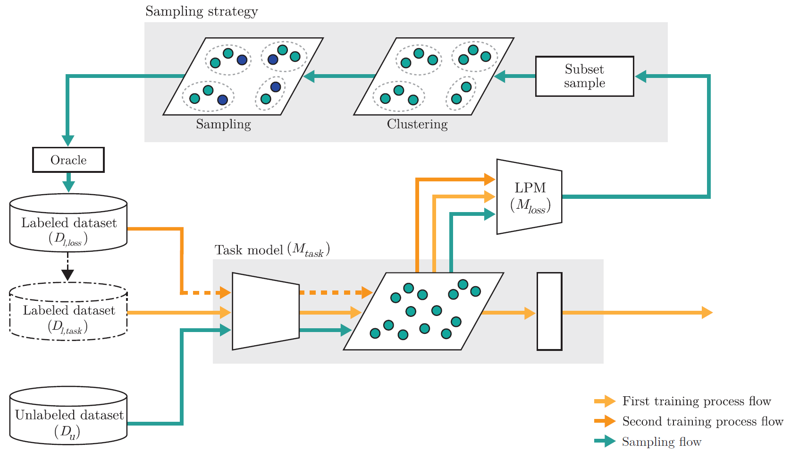

# Uncertainty-based Selective Clustering for Active Learning - official Pytorch implementation of the IEEE Access, vol.10, 2022

__*Sekjin Hwang, Jinwoo Choi, Joonsoo Choi*__

Official Pytorch implementation for [the paper](https://ieeexplore.ieee.org/abstract/document/9925155) published on IEEE Access titled "_Uncertainty-based Selective Clustering for Active Learning_".

</img>
